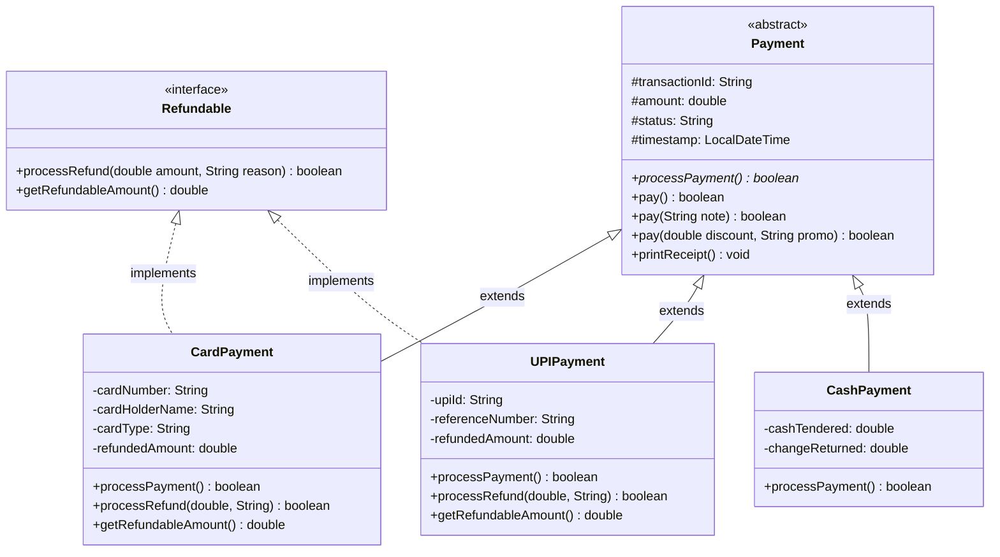
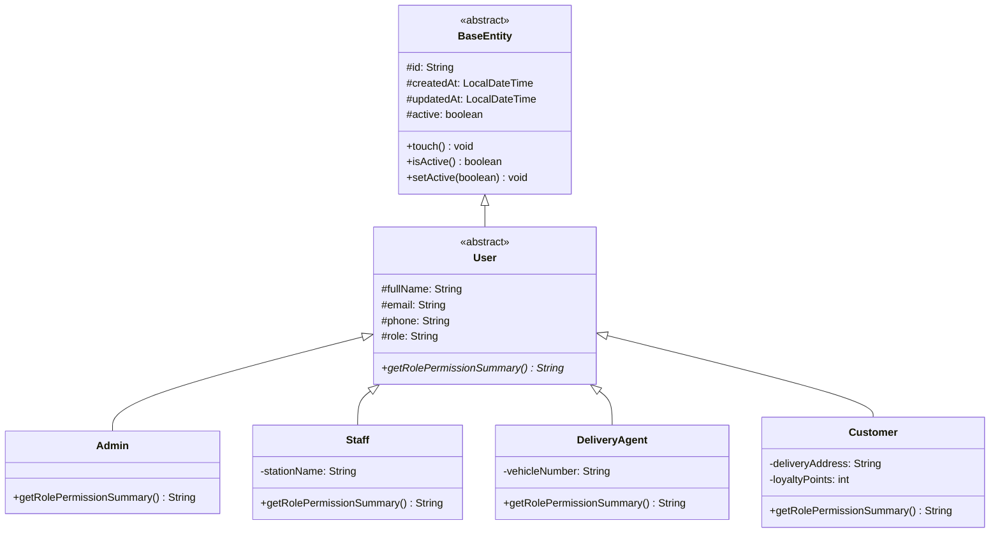
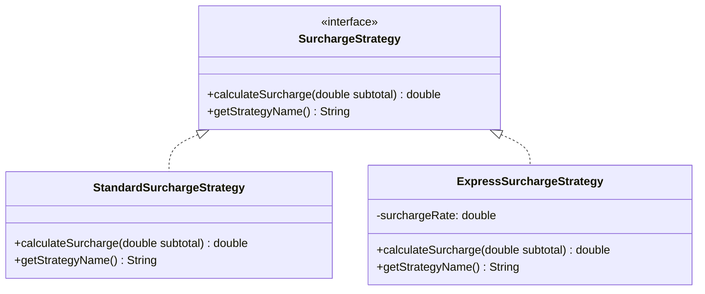

# Day 05 - UML Architecture Diagrams

## 1. Payment Hierarchy & Refundable Interface

```mermaid
classDiagram
    class Refundable {
        <<interface>>
        +processRefund(double amount, String reason) boolean
        +getRefundableAmount() double
    }

    class Payment {
        <<abstract>>
        #transactionId: String
        #amount: double
        #status: String
        #timestamp: LocalDateTime
        +processPayment()* boolean
        +pay() boolean
        +pay(String note) boolean
        +pay(double discount, String promo) boolean
        +printReceipt() void
    }

    class CardPayment {
        -cardNumber: String
        -cardHolderName: String
        -cardType: String
        -refundedAmount: double
        +processPayment() boolean
        +processRefund(double, String) boolean
        +getRefundableAmount() double
    }

    class UPIPayment {
        -upiId: String
        -referenceNumber: String
        -refundedAmount: double
        +processPayment() boolean
        +processRefund(double, String) boolean
        +getRefundableAmount() double
    }

    class CashPayment {
        -cashTendered: double
        -changeReturned: double
        +processPayment() boolean
    }

    Payment <|-- CardPayment : extends
    Payment <|-- UPIPayment : extends
    Payment <|-- CashPayment : extends
    Refundable <|.. CardPayment : implements
    Refundable <|.. UPIPayment : implements
```

---

## 2. Laundry Service User Role Hierarchy

```mermaid
classDiagram
    class BaseEntity {
        <<abstract>>
        #id: String
        #createdAt: LocalDateTime
        #updatedAt: LocalDateTime
        #active: boolean
        +touch() void
        +isActive() boolean
        +setActive(boolean) void
    }

    class User {
        <<abstract>>
        #fullName: String
        #email: String
        #phone: String
        #role: String
        +getRolePermissionSummary()* String
    }

    class Admin {
        +getRolePermissionSummary() String
    }

    class Staff {
        -stationName: String
        +getRolePermissionSummary() String
    }

    class DeliveryAgent {
        -vehicleNumber: String
        +getRolePermissionSummary() String
    }

    class Customer {
        -deliveryAddress: String
        -loyaltyPoints: int
        +getRolePermissionSummary() String
    }

    BaseEntity <|-- User
    User <|-- Admin
    User <|-- Staff
    User <|-- DeliveryAgent
    User <|-- Customer
```

---

## 3. Surcharge Strategy Pattern

```mermaid
classDiagram
    class SurchargeStrategy {
        <<interface>>
        +calculateSurcharge(double subtotal) double
        +getStrategyName() String
    }

    class StandardSurchargeStrategy {
        +calculateSurcharge(double subtotal) double
        +getStrategyName() String
    }

    class ExpressSurchargeStrategy {
        -surchargeRate: double
        +calculateSurcharge(double subtotal) double
        +getStrategyName() String
    }

    SurchargeStrategy <|.. StandardSurchargeStrategy
    SurchargeStrategy <|.. ExpressSurchargeStrategy
```
